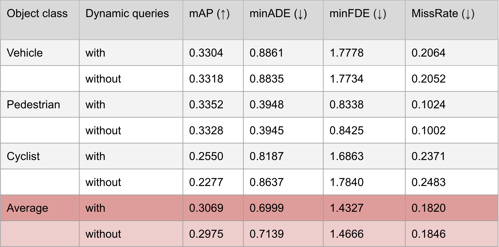

# civil_459_project: Multimodal joint vehicle trajectory prediction

## Project description

This repo contains the code for our final project in the course 
[*Deep Learning for Autonomous Vehicles* (CIVIL-459)](https://edu.epfl.ch/coursebook/en/deep-learning-for-autonomous-vehicles-CIVIL-459) 
at [EPFL](https://www.epfl.ch/en/).
Its goal is to explore deep learning models to perform multimodal joint vehicle trajectory 
prediction.
To train this kind of models on huge datasets, we have used the [Izar GPU cluster](https://www.epfl.ch/research/facilities/scitas/hardware/izar/).

## Chosen method & dataset.

We have chosen to use the [Motion TRansformer](https://arxiv.org/abs/2209.13508) 
(MTR) architecture that was proposed in 2021 by Shaoshuai Shi, Li Jiang, Dengxin Dai and Bernt Schiele.
This transformer based architecture used novel design elements (like motion query pairs
composed of a static and a dynamic query, or iterative refinement of the predicted
trajectories) to achieve state-of-the-art results on the [Waymo Open Motion Dataset](https://waymo.com/open/) (WOMD).
The original code was made publicly available [here](https://github.com/sshaoshuai/MTR) 
and was based on WOMD. 
This data was readily avilable and pre-processed on the Izar cluster, so we decided to use it.

## Experiments and results

> Disclaimer: Due to time and resources limitations (in particular the limitation to one node 
with only 2 Nvidia V100 GPUS), we only trained on 20% of the data for only 15 epochs.
> The original authors trained on 100% of the data for 30 epochs with 8 RTX 8000 GPUs.

In our experiments we tried to demonstrate the effect of the presence of the dynamic query pairs.
As seen in the table below, the average performance is marginally but still better 
with the dynamic queries.



On the visualization below we can see that without dynamic queries, the model tends to
predict trajectories that do not properly follow the road or even leave it.


## Usage
> Remark: The following section describes the usage on the Izar cluster. 
> Commands can be adapted to other machines and SLURM clusters, but the data has 
> to be downloaded and pre-processed by hand, which is not documented here.

### Requirements & setup on Izar

The project requirements are defined in the [`requirements.txt`](requirements.txt) file and comprise 
[pytorch](https://pytorch.org/) for training and [tensorflow](https://www.tensorflow.org/) for evaluation 
(using waymo's official evaluation packages).
In this project we assume a virutal environment called `MTR` was created with `venv` in the  `~/venvs` directory.
The MTR code uses custom CUDA extensions, so they have to be built by installing MTR as a package.

You can find below instructions to setup eveything on Izar:
```bash
module load gcc python/3.7.7
mkdir -p ~/venvs
cd ~/venvs
python3 -m venv MTR
source MTR/bin/activate
# clone the repository wherever you want and cd inside
echo "I suppose I am inside"
# before running the following you may have to book an iteractive session with a gpu allocated
pip3 install -U pip
pip3 install -r requirements.txt
pip3 install -e MTR
```

### Project structure

1. The [MTR](MTR) folder contains the code of [the original repo](https://github.com/sshaoshuai/MTR).
   The train and test python scripts can be found in [MTR/tools](MTR/tools). 
   The configuration files (the original ones and the ones we created for this project)
   can be found in [MTR/tools/cfgs/waymo](MTR/tools/cfgs/waymo/).
   The model definition can be found in [MTR/mtr/models](MTR/mtr/models).
2. We have added the following scripts:
   - [train.sh](train.sh) and [test.sh](test.sh) to train and test the models on Izar.
   - [visualize.py](visualize.py) to visualize the predictions of a trained model.


### Training and testing

We have created 2 configurations in [MTR/tools/cfgs/waymo](MTR/tools/cfgs/waymo/) 
called `dlav_with_dynamic_queries.yaml` and `dlav_without_dynamic_queries.yaml`
to reproduce our experiments (training on 20% of the data for 15 epochs, with and 
without dynamic queries).

We have also created two batch files that can be used on Izar to train and evaluate 
the models for both configurations (by simply commenting/uncommenting a line in these files).
They can be ran with:
```bash
sbatch train.sh
sbatch test.sh
```

> Remark: the train script has a timeout for 10h, so it has to be restarted several 
> times for the 15 epochs to be completed. On one Izar node, the 15 epochs take
> roughly 45h, or just under 2 days.

### Visualization

To launch the visualization script on you can use:
```bash
python3 visualize.py --cfg_file MTR/tools/cfgs/waymo/dlav_with_dynamic_queries.yaml
```
You may have to modify in the script:
- the path to the model
- the filename of the scene to visualize

### Pre-trained models

In our [latest release](https://github.com/tudoroancea/civil_459_project/releases/tag/MTR-pretrained)
you can find the model weights for the two configurations we have used in our experiments:
- `dlav_with_dynamic_queries.pth` -> `dlav_with_dynamic_queries.yaml`
- `dlav_without_dynamic_queries.pth` -> `dlav_without_dynamic_queries.yaml`